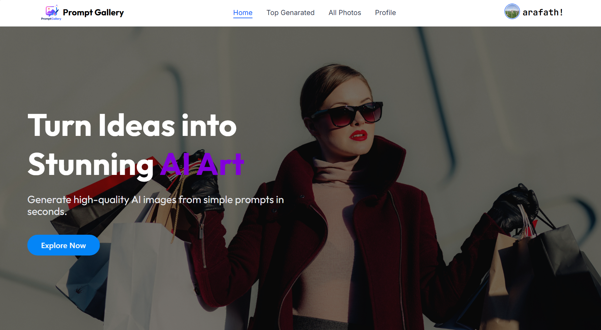
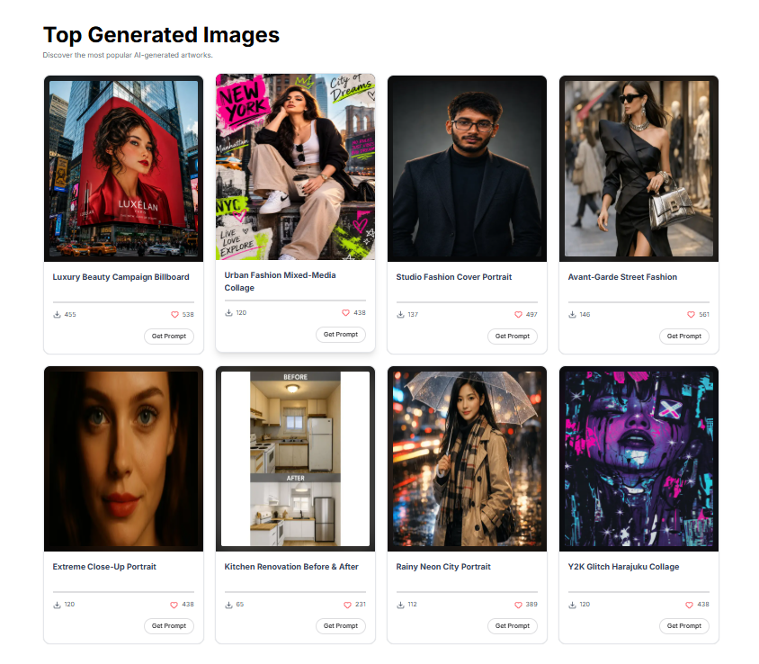
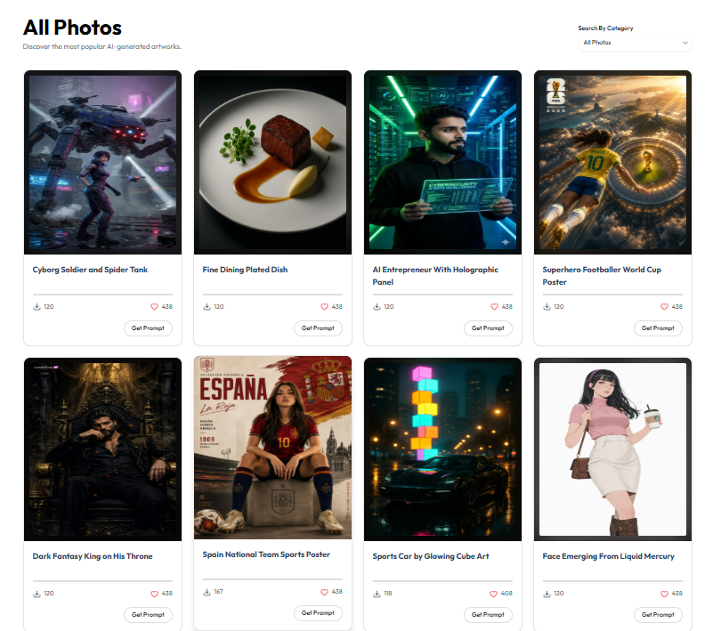

# 🎨 Prompt Gallery

> A modern AI-generated image gallery where users can explore, filter, and discover curated prompts across multiple art styles — then take any prompt straight to their favorite AI image generator (ChatGPT, Gemini, Midjourney, DALL·E, Stable Diffusion, and more) to create their own version of the artwork.

<p align="center">
  <a href="https://promptgallery-ai.vercel.app/"></a>
  <a href="https://github.com/RS-Arafath"></a>
  <a href="https://rs-arafath.vercel.app"></a>
</p>


## Home
<p align="center">
  
</p>

## Top Genarated and All Photos
<p align="center">
  
  
</p>

---

## 📖 Overview

**Prompt Gallery** is a full-stack Next.js application that showcases AI-generated artwork across 9 distinct categories — Sci-Fi, Pixel Art, Fantasy, Cyberpunk, Surreal, Vaporwave, Realistic, Minimal, and Steampunk. Users can browse the gallery, filter by category, view individual prompts, and sign in with secure authentication to interact with the platform.

This project was built as a hands-on learning exercise to strengthen real-world MERN and Next.js skills — including authentication flows, server-side data handling, dynamic filtering with URL state, and responsive UI design.

---

## ✨ Features

- **🖼️ AI Image Gallery** — Browse a curated collection of AI-generated artwork with title, prompt, and category metadata
- **🔍 Category Filtering** — Dynamic dropdown to filter the gallery by category (Sci-Fi, Fantasy, Cyberpunk, etc.) using URL search params, so filtered views are shareable and support browser back/forward navigation
- **🔐 Authentication** — Secure sign-in/sign-up powered by [Better Auth](https://www.better-auth.com/), including Google OAuth account linking
- **👤 Profile Management** — Responsive profile modal with session-aware avatar integration in the Navbar
- **❤️ Like & Download Tracking** — Per-image like button and download counter
- **📄 Prompt Detail Pages** — Dedicated page per image to view and copy the full AI prompt
- **⚡ Loading States** — Route-level skeleton loaders (`loading.jsx`) for smooth transitions while filtered data loads
- **📱 Fully Responsive** — Mobile-first layout using Tailwind CSS grid, tested across breakpoints
- **☁️ Deployed on Vercel** — Production build with environment-based configuration

---

## 🛠️ Tech Stack

| Category | Technology |
|---|---|
| Framework | [Next.js 16](https://nextjs.org/) (App Router) |
| UI Library | [HeroUI v3](https://heroui.com/) |
| Styling | [Tailwind CSS v4](https://tailwindcss.com/) |
| Authentication | [Better Auth](https://www.better-auth.com/) + MongoDB Adapter |
| Database | [MongoDB](https://www.mongodb.com/) |
| Icons | Lucide React, Iconify, Gravity UI Icons |
| Notifications | React Hot Toast / React Toastify |
| Analytics | Vercel Analytics |
| Deployment | Vercel |

---

## 🚧 Challenges Faced & How They Were Solved

Building this project came with several real-world debugging challenges — documenting them here for future reference and for anyone learning from this repo.

### 1. Category Search / Dropdown Filtering
The trickiest part of this project. The goal was a dropdown that filters the gallery by category via URL search params (`?category=Fantasy`), keeping filtering logic on the server.


- **`searchParams` not being passed:** A shared `AllPhotos` preview component (used on the homepage) was also trying to read `searchParams`, but since it wasn't a route-level page, Next.js never injected that prop — causing a `Cannot destructure property 'category' of 'undefined'` runtime error. Fixed by removing category-filtering logic from the homepage preview entirely and keeping it scoped to the dedicated `/allPhotos` route.
- **Missing "All Photos" reset option:** The dropdown initially only listed specific categories with no way to clear the filter. Solved by adding a manual `"all"` option that deletes the `category` param from the URL when selected.
- **Loading state on filter change:** Added a route-level `loading.jsx` (App Router convention) inside `app/allPhotos/` so a skeleton grid displays while the server refetches and filters data — being careful to place it at the correct route level and not conflict with the existing `[id]/loading.jsx` used for the photo detail page.

### 2. Proxy
Next.js 16 renamed the `middleware` file convention to `proxy` — same execution model (runs server-side before a request completes), just a new file name (`proxy.js`) and exported function name (`proxy`) instead of `middleware`.
 
In this project, `proxy.js` acts as a route guard for protected pages. On every request to a matched route, it checks for an active session using Better Auth's session API. If no valid session is found, the user is redirected to `/signin` before the page is ever rendered — so unauthenticated users never see the protected content, rather than being redirected after the fact. The guard currently applies to the **All Photos** and **Top Generated** routes, keeping gallery browsing behind authentication while still allowing the homepage and auth pages to remain publicly accessible.


### 3. Static Generation vs. Dynamic Data
Using `fetch()` to read local JSON data during static generation caused build failures on Vercel. Replaced with Node's `fs.readFile` to read directly from the `public/` directory at build/request time, which resolved the issue.

### 4. Vercel Deployment Failures
Build failures on Vercel traced back to missing environment variables that were only configured locally. Fixed by explicitly setting all required env vars (MongoDB URI, Better Auth secrets, OAuth credentials) in the Vercel project settings.

### 5. Better Auth — Google OAuth Account Linking
Encountered `account_not_linked` errors when signing in with Google after registering with email/password. Root cause traced to `emailVerified: false` on the existing MongoDB user document, which blocked Better Auth from linking the OAuth account. Resolved by correcting the email verification state.

### 6. Hardcoded Localhost URLs
The `auth-client` configuration had a hardcoded `localhost` base URL, which broke authentication in production. Fixed by dynamically resolving the base URL based on environment (development vs. production).

---

## 📂 Project Structure (simplified)

```
prompt-gallery/
├── public/
│   ├── allPhotos.json       # Gallery image dataset
│   ├── category.json        # Category list (id, name, slug)
│   └── images/               # README / marketing screenshots
├── src/
│   ├── app/
│   │   ├── allPhotos/
│   │   │   ├── loading.jsx   # Skeleton loader for filtered grid
│   │   │   ├── page.jsx      # Gallery listing + category filter
│   │   │   └── [id]/
│   │   │       ├── loading.jsx
│   │   │       └── page.jsx  # Single prompt detail page
│   │   ├── api/auth/[...all]/route.js
│   │   ├── profile/
│   │   ├── signin/
│   │   └── topGenerated/
│   ├── components/
│   │   ├── AllPhotos.jsx     # Homepage gallery preview
│   │   ├── Category.jsx      # Category filter dropdown
│   │   ├── Navbar.jsx
│   │   ├── ProfileModal.jsx
│   │   └── shared/LikeButton.jsx
│   └── lib/
│       ├── auth.js
│       └── auth-client.js
└── package.json
```

---

## ⚙️ Getting Started

### Prerequisites
- Node.js 18+
- A MongoDB database (local or Atlas)
- Google OAuth credentials (for social login)

### Installation

```bash
git clone https://github.com/RS-Arafath/prompt-gallery.git
cd prompt-gallery
npm install
```

### Environment Variables

Create a `.env` file in the root directory:

```env
MONGODB_URI=your_mongodb_connection_string
BETTER_AUTH_SECRET=your_secret_key
BETTER_AUTH_URL=http://localhost:3000
GOOGLE_CLIENT_ID=your_google_client_id
GOOGLE_CLIENT_SECRET=your_google_client_secret
```

### Run Locally

```bash
npm run dev
```

Visit `http://localhost:3000` to view the app.

### Build for Production

```bash
npm run build
npm run start
```

---

## 🤝 Contributing

This is primarily a personal learning project, but suggestions and feedback are always welcome. Feel free to open an issue or fork the repo.

---

## 📬 Contact

- **Email:** contact.arafath.bd@gmail.com
- **GitHub:** [github.com/RS-Arafath](https://github.com/RS-Arafath)
- **Portfolio:** [rs-arafath.vercel.app](https://rs-arafath.vercel.app)

---

<p align="center">Made with ❤️ by RS Arafath</p>